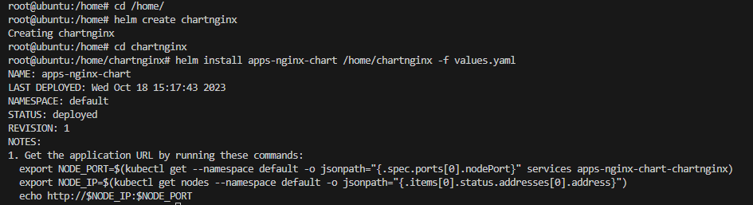
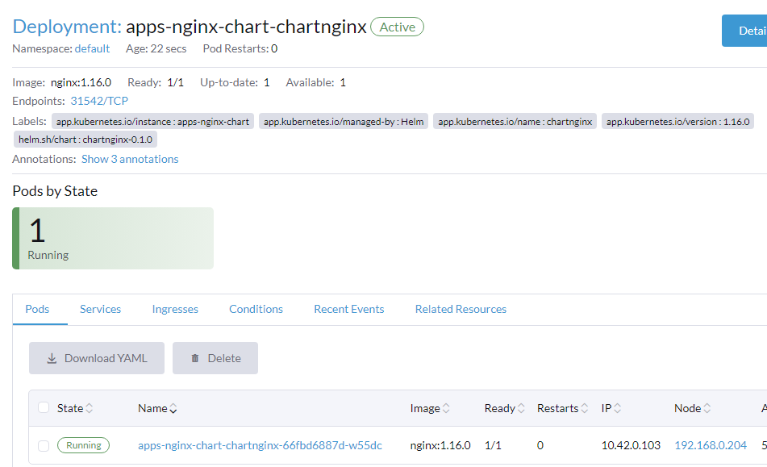

# masuk ke folder home
cd /home/
# buat chart
helm create chartnginx
# masuk ke folder chart yang sudah dibuat
cd chartnginx
# edit values.yaml cari service bagian type ubah ClusterIP dengan NodePort
# jalankan install
helm install apps-nginx-chart /home/chartnginx -f values.yaml 

